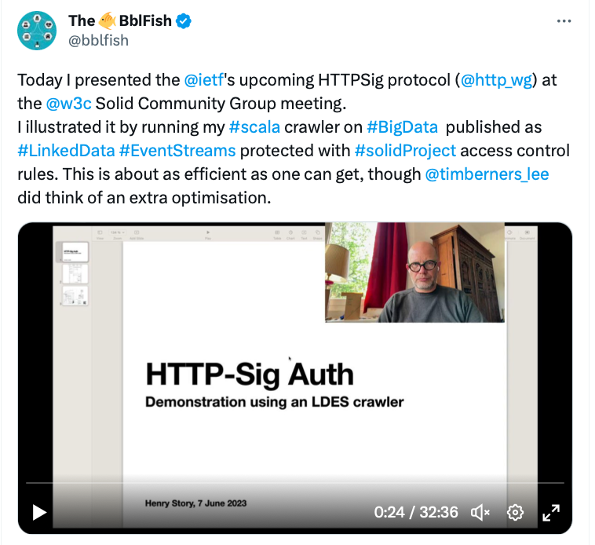

# Access Control Client Logic

As a participant in the EU [Vlaamse Smart Data Space](https://www.imec-int.com/en/flemish-smart-data-space) project, I worked on translating (public) data from CSV format to a [Linked Data Stream](https://joinup.ec.europa.eu/collection/semic-support-centre/linked-data-event-streams-ldes). 
This data provided a very good use case for writing, testing and tuning a basic LDES crawler that could work with a Solid Wallet to automatically authenticate the client with the minimal number of requests, as would be needed for a Big Data Space application. 

Working on this required updates to the software on the client and the server, which also led to a suggestion to improve the Solid Protocol to make finding Access Control Rules Optimally Efficient.

The result of the work was presented at the Wednesday 07-06-2023 Solid Community Group Meeting (see [meeting transcript](https://github.com/solid/specification/blob/main/meetings/2023-06-07.md))
with a demo of a Crawler shown in the video uploaded to this tweet: 

See also [the conversation on Mathstodon](https://mathstodon.xyz/@bblfish/110507642925989004).

## Reactive Solid Server Improvements

The Reactive Solid Server had not implemented the default rules as per [Web Access Control spec](https://solidproject.org/TR/wac) `wac:default` feature.
This was done in two major PRs:
 - [PR 24 - update bobcat, httpSig, default ACRs, PUT that creates dirs, registry generalisation](https://github.com/co-operating-systems/Reactive-SoLiD/pull/24) which added LDES examples and implemented [Coin and Document Effective ACL URI](https://github.com/solid/specification/issues/325).
 - [PR 25 - Update default ACL behaviour](https://github.com/co-operating-systems/Reactive-SoLiD/pull/25): after working on finishing the client implementation it became clear that having a resource link directly to the effective ACL did not work that well with the client cache, as explained in the new [issue 531: `defaultAccessContainer` Link header](https://github.com/solid/specification/issues/531)
 

## Client Crawler

A very basic crawler (the [LDES Spider](https://github.com/bblfish/SolidCtrlApp/blob/CommandLine/ldes/shared/src/main/scala/run/cosy/ldes/LdesSpider.scala)) was written as part of the VSDS project to crawl the VSDS linked data. We then updated this to support default rules and added a cache so as to minimize the requests to the server.

In September 2022 we started [PR 1 of SolidCtrl App: Command Line Client Support](https://github.com/bblfish/SolidCtrlApp/pull/1) which was committed in December. 

[PR 3 of SolidCtrl App - ACL Link behavior update](https://github.com/bblfish/SolidCtrlApp/pull/3) is a large commit that added caching to the client wallet and has the ability to follow `defaultAccessContainer` links produced by the Reactive-Solid server mentioned above. We now can crawl the LDES data with a max of only 2 extra requests (to find the acl).

## Solid Spec proposals

* [`defaultAccessContainer` Link header (issue 531)](https://github.com/solid/specification/issues/531) as an improvement over [Oct 18, 2021 issue 325: Coin and document effective ACL URI](https://github.com/solid/specification/issues/325).
* [Solid Resources needs a way to tell what their containers are](https://github.com/solid/specification/issues/528).